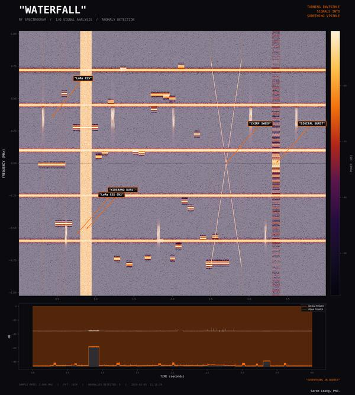
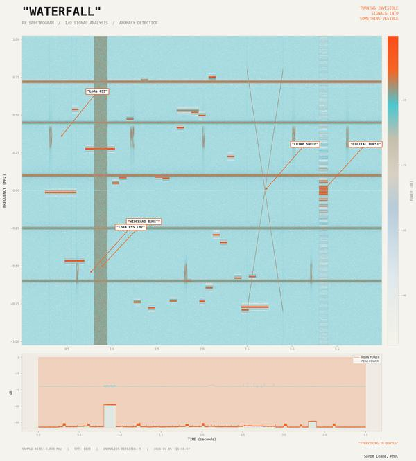
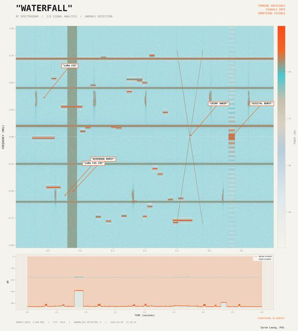
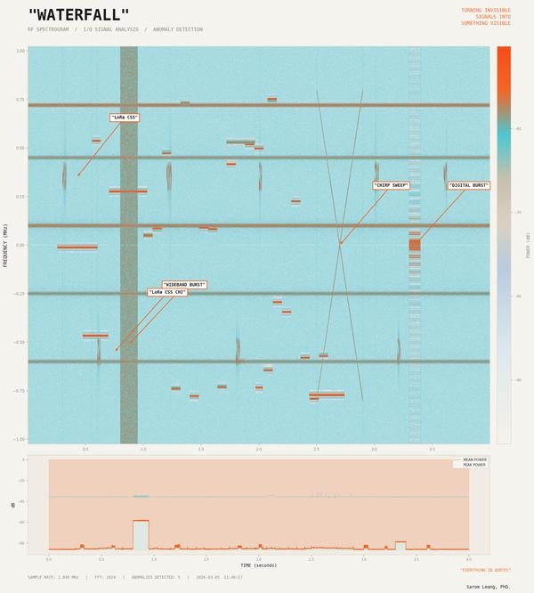
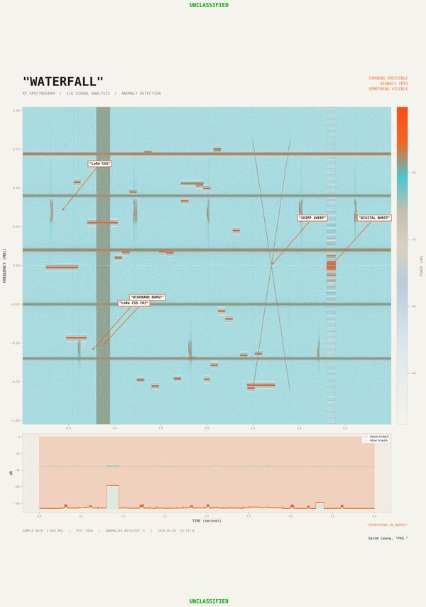
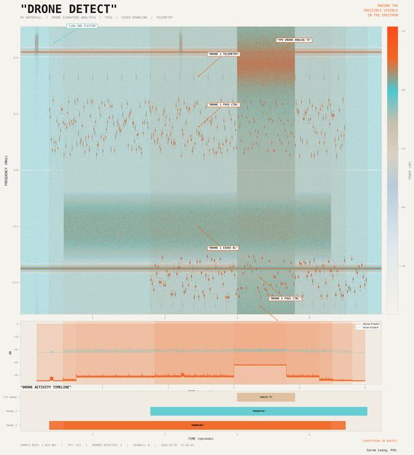
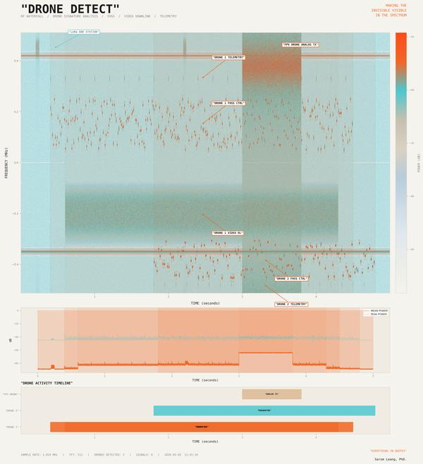
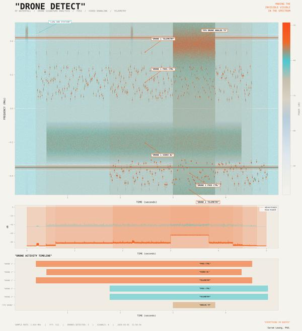
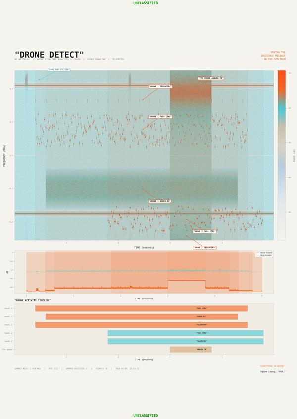

# "SIGNAL"

**RF Signal Waterfall Visualization & Drone Detection**

Turning invisible signals into something visible and interpretable.

Inspired by Virgil Abloh's philosophy — the 3% shift, quotation marks, transparency, and cross-disciplinary curiosity — this project generates synthetic I/Q signal data, transforms it into waterfall spectrograms, detects anomalies, and produces annotated visualizations that treat technical data as a creative medium.

---

## RF Signal Waterfall

Generates a synthetic RF environment with narrowband carriers, pulsed transmissions, frequency-hopping signals, LoRa CSS (Chirp Spread Spectrum) on two channels, and deliberate anomalies (wideband burst, chirp sweep, digital burst). Produces an annotated waterfall spectrogram with anomaly detection and a power-over-time plot.

```
python rf_waterfall.py
```

### Gallery

<div style="display: flex; flex-wrap: wrap; gap: 12px;">
  <a href="images/full/rf_waterfall_outputV1.jpg"></a>
  <a href="images/full/rf_waterfall_outputV2.jpg"></a>
  <a href="images/full/rf_waterfall_outputV3.jpg"></a>
  <a href="images/full/rf_waterfall_outputV4.jpg"></a>
  <a href="images/full/rf_waterfall_outputV5.jpg"></a>
  <a href="images/full/rf_waterfall_outputV6.jpg"></a>
  <a href="images/full/rf_waterfall_outputV7.jpg"></a>
</div>

---

## Drone RF Signature Detection

Simulates an RF environment containing three drone signatures — a DJI-style craft (FHSS control, video downlink, telemetry), a smaller drone (FHSS + telemetry), and an FPV analog video transmission — alongside background carriers and a LoRa ground station. Includes a drone activity timeline panel.

```
python rf_drone_detect.py
```

### Gallery

<div style="display: flex; flex-wrap: wrap; gap: 12px;">
  <a href="images/full/rf_drone_outputV1.jpg"></a>
  <a href="images/full/rf_drone_outputV2.jpg"></a>
  <a href="images/full/rf_drone_outputV3.jpg"></a>
  <a href="images/full/rf_drone_outputV4.jpg"></a>
</div>

---

## Setup

```
pip install -r requirements.txt
```

Dependencies: `numpy`, `scipy`, `matplotlib`

## Author

Sarom Leang, "PhD."
